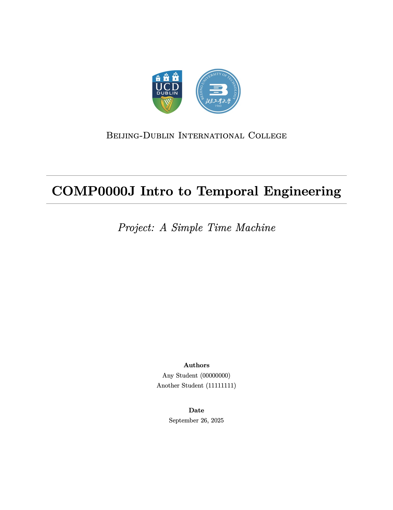
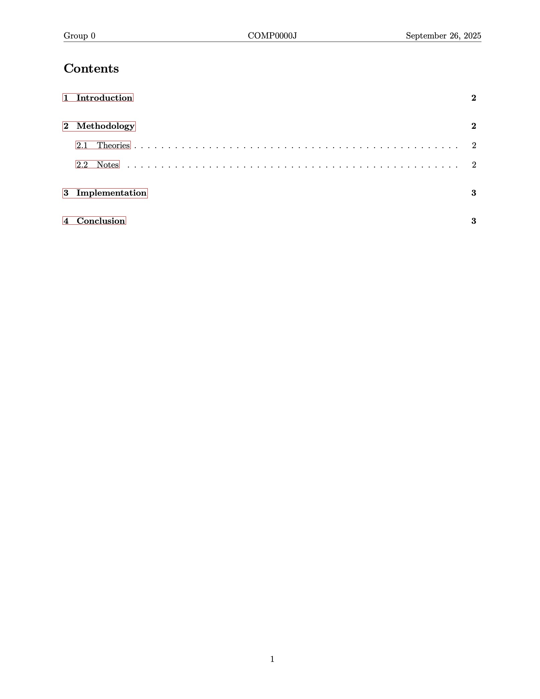
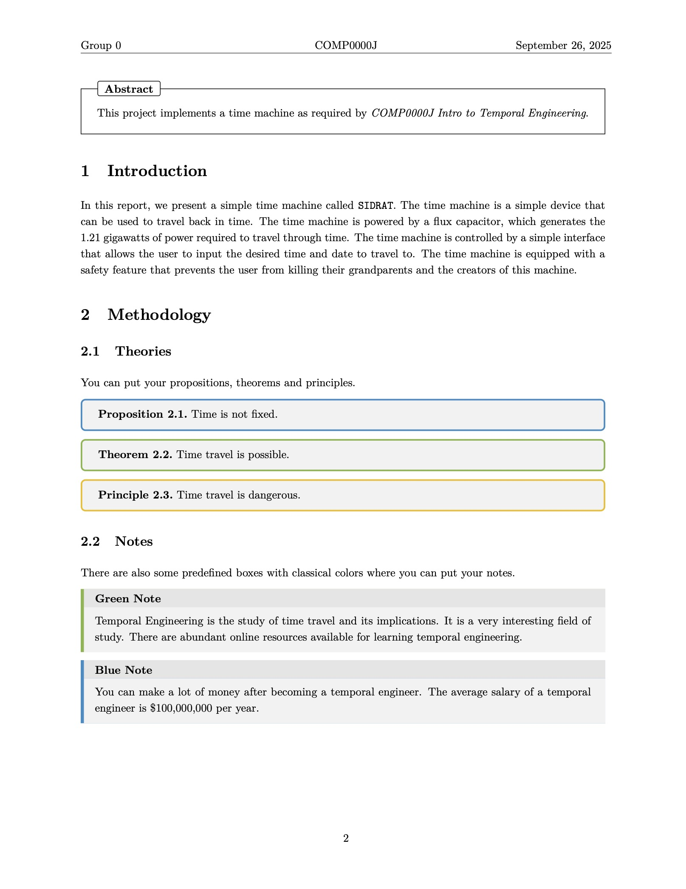
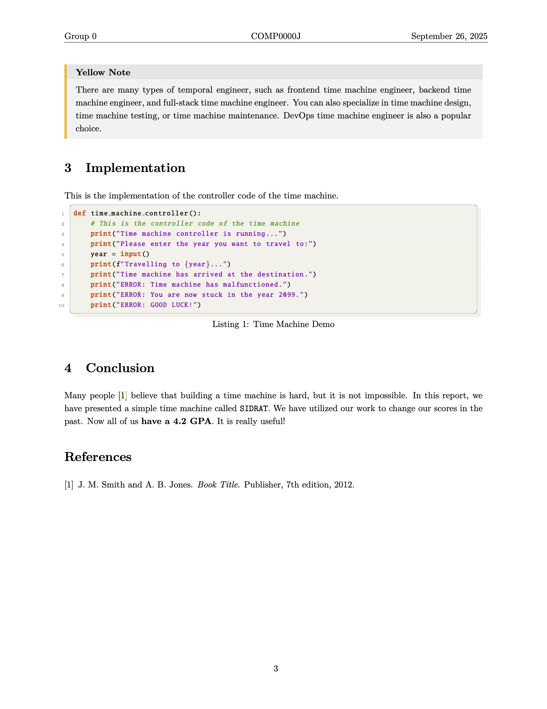
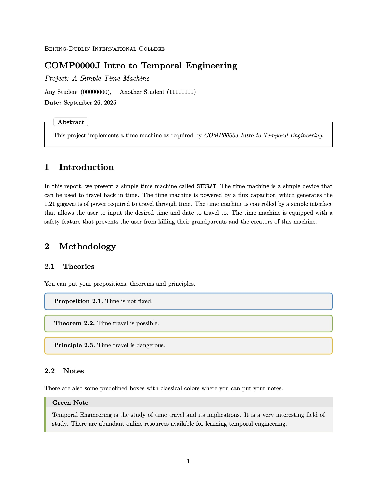

# LaTeX Report Template for BDIC Modules

A simple but elegant LaTeX template for reports for various modules in Beijing-Dublin International College (BDIC), inspired by [this template](https://www.overleaf.com/latex/templates/math-notes-template/kfqdrzrzpvvk).

## Screenshots

### Report with Independent Title Page

<table>
  <tr>
    <td></td>
    <td></td>
  </tr>
</table>
<table>
  <tr>
    <td></td>
    <td></td>
  </tr>
</table>

### Report with Compact Title

<table>
  <tr>
    <td></td>
  </tr>
</table>

## Suggestions

1. 在该项目的文件结构中，应该将跟文档内容相关的图片放在 `figures` 路径下，将用于装饰目的的图片放到 `images` 路径下。*(In the file structure of this project, pictures relevant to the main content of the document should be placed under `figures`, while pictures for decorative purposes should be put into `images`.)*

2. 在编辑文章的不同部分时，最好把每部分的内容分别放到 `src` 路径下的不同文件中，以使主 TeX 文件更加整洁。*(When editing different sections of the document, it is better to put each section into a separate file under the `src` directory to keep the main TeX file neat and clear.)*

3. 如果需要在 Overleaf 上编辑该文档，首先将该项目下载为 `.zip` 文件，然后在 Overleaf 上选择 **New Project > Upload Project**，再把 `.zip` 文件拖到弹出的窗口中即可。*(To edit the document on Overleaf, first download the project as a `.zip` file. Then, in Overleaf, select **New Project > Upload Project** and simply drag the `.zip` file into the popup window.)*

4. 该文档的代码中提供了多种选项，可以被方便地启用或禁用。`.cls` 文件的代码十分简单且结构清晰，用户可以对其进行修改来贴合其具体需求。 *(There are plenty of options in the template code that are easy to enable or disable. The source code for the `.cls` file is simple and well-structured and you are welcome to customize the template to suit your needs.)*

> [!NOTE]
> Please note that this template is **not** an official report template approved or provided by University College Dublin or Beijing University of Technology.
